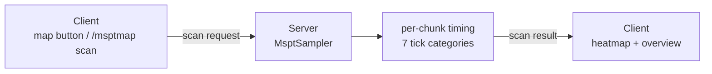

<div align="center">


# MsptMap

**A per-chunk MSPT heatmap for [Xaero's World Map](https://modrinth.com/mod/xaeros-world-map).**
Identifies the specific chunks responsible for server-side lag.

[](https://modrinth.com/mod/msptmap)
[](#supported-versions)
[](#-requirements)
[](#supported-versions)
[](#-installation)
[](#-license)
[](https://github.com/Drizzle379/MsptMap/releases)
[](https://github.com/Drizzle379/MsptMap)

**English** · [简体中文](README.zh-CN.md)

[Features](#-features) · [Requirements](#-requirements) · [Installation](#-installation) · [Usage](#-usage) · [Commands](#-commands) · [Monitoring](#-monitoring) · [Configuration](#-configuration) · [How it works](#-how-it-works) · [Building](#-building)

</div>

---

## ✨ Features

| | |
| :--- | :--- |
| 🌡️ **Per-chunk heatmap** | Chunks are coloured green → yellow → red according to the tick time they consume. Weakly-loaded chunks that performed no measurable work remain pale grey, so that areas of genuine load are not obscured. |
| 🧩 **Seven tick categories** | Random ticks, scheduled ticks, block updates, block events, block entities, entities and mob spawning are measured independently; the tooltip identifies the category to which the cost belongs. |
| 🏷️ **Load source lookup** | The load ticket behind each chunk is resolved: `player_loading`, `forced`, `portal`, `ender_pearl`, `dragon`, and others. Chunks that hold a ticket are outlined in blue, and the tooltip reports the ticket name together with the `@x,z` coordinates of the chunk on which the ticket resides. |
| 📊 **Scan overview** | A single panel reports total mspt, entity count, load sources and the five most costly chunks, aggregated across **all three dimensions**, whereas the map itself displays one dimension at a time. |
| 🖱️ **Click to locate** | Selecting an entry in the overview moves the map to the corresponding chunk. A fold row expands the complete source list, which supports scrolling. |
| 📡 **Optional monitoring** | Off by default. When enabled, the server watches MSPT and, on sustained overload, scans on its own and alerts the online operators with a clickable list of the five most costly chunks. |
| 🔁 **Version tolerance** | The client and the server are not required to run the same version. A version mismatch still produces a result, accompanied by a chat notice; a packet that cannot be interpreted is reported as a failure in chat and does not disconnect the client. |

## 📦 Requirements

| Dependency | Required | Notes |
| :--- | :--- | :--- |
| **Minecraft** | Yes | See [supported versions](#supported-versions) |
| **Fabric Loader** | Yes | ≥ 0.19.3 |
| [Fabric API](https://modrinth.com/mod/fabric-api) | Yes | |
| [Xaero's World Map](https://modrinth.com/mod/xaeros-world-map) | Client only | Injection anchors verified on Xaero 1.44.2 / 1.46.0 / 1.46.4 (most versions use 1.46.0). Should a future Xaero update invalidate an anchor, the button and heatmap are disabled and the game starts normally. |
| [Mod Menu](https://modrinth.com/mod/modmenu) | Recommended | Provides a shortcut to the settings screen |

### Supported versions

| Minecraft | Build directory | Runtime Java | Fabric API floor |
| :--- | :--- | :--- | :--- |
| 1.20 – 1.20.2 | `versions/1.20.1` | 17 | `0.91.0+1.20.1` |
| 1.20.3 – 1.20.4 | `versions/1.20.4` | 17 | `0.97.1+1.20.4` |
| 1.21 – 1.21.1 | `versions/1.21.1` | 21 | `0.116.17+1.21.1` |
| 1.21.2 – 1.21.4 | `versions/1.21.4` | 21 | `0.119.4+1.21.4` |
| 1.21.6 – 1.21.10 | `versions/1.21.8` | 21 | `0.136.1+1.21.8` |
| 1.21.11 | `versions/1.21.11` | 21 | `0.141.6+1.21.11` |
| 26.1 – 26.1.2 | `versions/26.1.2` | 25 | `0.155.3+26.1.2` |
| 26.2 | `versions/26.2` | 25 | `0.158.0+26.2` |
| 26.3 | `versions/26.3` | 25 | `0.158.0+26.3` |

> [!NOTE]
> **1.20.5, 1.20.6 and 1.21.5 are not supported.** Each row above corresponds to one jar; a full build produces one per row.

## 🚀 Installation

Download the latest build from [Modrinth](https://modrinth.com/mod/msptmap) or the [releases page](https://github.com/Drizzle379/MsptMap/releases), then place the jar in the `mods/` directory.

> [!IMPORTANT]
> Sampling is performed on the **server**, so the mod is required on both sides. The client additionally requires Xaero's World Map. In single-player, both sides run on the same machine and a single copy suffices.

The server and the client may run different versions of MsptMap. A mismatch still yields a result, with a chat notice that it may be inaccurate; a packet that cannot be interpreted is reported in chat as a failure and does not disconnect the client.

## 🎮 Usage

1. Open the world map and select the **scan** button in the upper-left corner, or run `/msptmap scan [seconds]`
2. Once sampling completes, chunks are coloured according to their tick cost: green → yellow → red; weakly-loaded chunks are pale grey
3. Hovering over a chunk displays its coordinates, load level, load ticket, entity count, total mspt and a per-category breakdown
4. The **scan overview** appears next to the scan button, reporting totals, load sources and the five most costly chunks. Selecting a row moves the map to that chunk; the fold row expands the complete source list
5. The ✕ button clears the heatmap

### Interpreting load tickets

The load ticket identifies the mechanism that keeps a chunk loaded: `player_loading` for a nearby player, `forced` for `/forceload`, `ender_pearl` for a thrown pearl, among others. The `@x,z` suffix gives the coordinates of the chunk on which the ticket resides; a chunk outlined in blue holds a ticket.

<details>
<summary>All ticket names</summary>

| Ticket | Reason the chunk remains loaded |
| :--- | :--- |
| `player_loading` | A player is within view distance (applied per chunk; no centre) |
| `player_simulation` | A player is within simulation distance |
| `forced` | The chunk was force-loaded with `/forceload` |
| `portal` | A portal is nearby |
| `ender_pearl` | A thrown ender pearl landed there |
| `player_spawn` | The chunk is the world spawn point (named `start` up to 1.21.10) |
| `spawn_search` | A spawn point search is in progress (1.21.11 and later) |
| `dragon` | The ender dragon fight holds the chunk |
| `unknown` | Vanilla's fallback ticket type |

> [!NOTE]
> Games through 1.21.4 have no queryable ticket table; the ticket name and its `@x,z` are therefore not displayed there, and only the load level is shown.
</details>

> [!NOTE]
> Total mspt excludes block updates: their cost is already accounted for within the category that triggered them, so including them would inflate the total.

> [!TIP]
> **Single-player:** the world is paused while the map is open; after selecting scan, close the map and wait.

## 🕹️ Commands

| Command | Side | Effect |
| :--- | :--- | :--- |
| `/msptmap scan [seconds]` | Both | Starts a scan and paints the result on the map. Omit `seconds` to use the configured value; range 1 – 60. At the console the result is logged instead. |
| `/msptmap access <ops\|all>` | Server | Who may start a scan: operators only (default) or every player. |
| `/msptmap config` | Client | Opens the settings screen, for when Mod Menu is not installed. |
| `/msptmap monitor` | Server | Prints the monitoring state and its settings. |
| `/msptmap monitor on` / `off` | Server | Master switch, off by default; turning it off also discards the current window and the cooldown. |
| `/msptmap monitor threshold <mspt>` | Server | Threshold to trigger on, 1.0 – 1000.0 (default `40.0`). |
| `/msptmap monitor consecutive <times>` | Server | Consecutive above-threshold checks required to trigger, 1 – 60 (default `3`). |
| `/msptmap monitor cooldown <minutes>` | Server | Span after a trigger in which no further scan starts, 1 – 1440 (default `5`). |
| `/msptmap monitor audience <op\|all>` | Server | Who is alerted: online operators only (default `op`), or every online player. |

Scanning is limited to vanilla permission level 2 (operators) by default; `/msptmap access all` opens it to every player and `/msptmap access ops` restores the default. The `access` and `monitor` subcommands are always restricted to operators.

## 📡 Monitoring

Off by default. When enabled, the server times every tick and, once the smoothed average stays above a threshold, starts a scan of its own: the five most costly chunks are sent to the online operators as a chat alert, and selecting a row opens the world map at that chunk. The scan chain is the same one described below — only the result goes to the operators instead of the requester.

Monitoring is an operator command; it is enabled with `/msptmap monitor on`, and its settings are stored in `config/msptmap-server.properties` — see [Commands](#-commands).

## 🔧 Configuration

Open **Mod Menu → Settings**, or run `/msptmap config`. Settings are stored in `config/msptmap-client.properties`.

<details>
<summary>All settings</summary>

| Group | Setting | Effect |
| :--- | :--- | :--- |
| Scan | **Seconds** | Length of the sampling window, in seconds (converted to game ticks) |
| Colors | **Relative mode** | Colours are scaled to the most costly chunk **in the current scan**, so that relatively costly chunks remain distinguishable under light overall load. When disabled, the fixed red threshold below is applied instead. |
| Colors | **Red threshold** | A chunk costing at least this value, in ms/tick, is displayed in the deepest red; below it, colour transitions continuously from green through yellow to red. Not applied, and not adjustable, while relative mode is enabled. |
| Colors | **Opacity** | Opacity of the heat fill, 0.05 – 1.00. Lower values reveal more of the underlying map. |
| Colors | **Show weak-loaded chunks** | Displays chunks at load level ≥ 32 that performed no measurable work in pale grey. |
| Hover details | **Coordinates** / **Levels** / **Entities** | Determines which lines appear in the hover tooltip. |
| Hover details | **Load ticket** / **Compute ticket** | Appends the ticket source to the load-level / compute-level line. |
| Hover details | **Show abbreviations** | Displays category names as two-letter codes: `RT ST BU EV BE EN SP`. |
| Hover details | **Show mspt unit** | Appends `mspt` to each category line. The total line displays its unit unconditionally. |

**Reset defaults** restores all of the above to their default values.
</details>

## 🧭 How it works



The server samples the time spent on seven kinds of tick work and sends the result to the client that initiated the scan, which then colours the map chunk by chunk.

| Category | Measured at |
| :--- | :--- |
| Random tick | `ServerLevel.tickChunk` |
| Scheduled tick | `ServerLevel.tickBlock` / `tickFluid` |
| Block update | The neighbour-update entry points of `ServerLevel` |
| Block event | `ServerLevel.doBlockEvent` |
| Block entity | `LevelChunk$BoundTickingBlockEntity.tick` |
| Entity | `ServerLevel.tickNonPassenger` |
| Mob spawning | `NaturalSpawner.spawnForChunk` |

> [!NOTE]
> Block updates are measured but excluded from the total: their cost is already contained within the category that triggered them — a redstone chain initiated by a scheduled tick, for example.

## 🔨 Building

Requires **JDK 25**.

```shell
./gradlew build    # gradlew.bat on Windows
```

This produces one jar per supported Minecraft version, named `MsptMap-Fabric-v<mod version>+<highest supported version>.jar`, under `versions/<minecraft-version>/build/libs/`.

## 📄 License

[MIT](LICENSE) © 2026 Drizzle379

<sub>Bug reports and feature requests: [open an issue](https://github.com/Drizzle379/MsptMap/issues) · Author: [Bilibili](https://space.bilibili.com/433418393)</sub>

<div align="right"><a href="#msptmap">↑ back to top</a></div>
